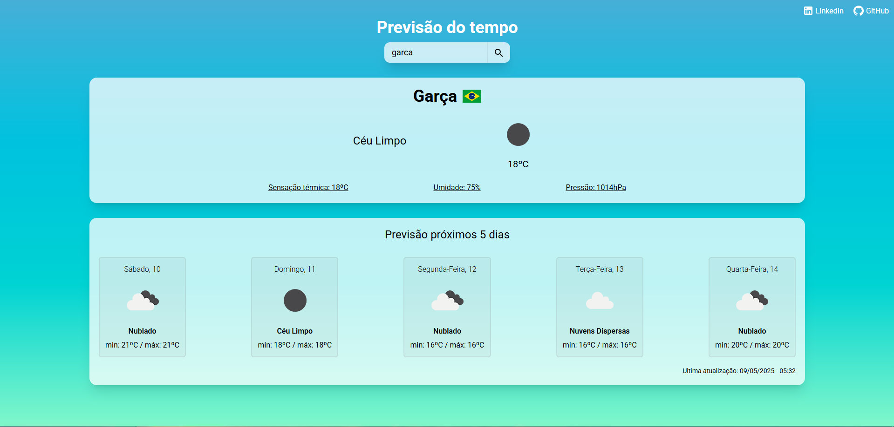

<h1 align="center">Previsão do tempo ⛅</h1>

Site de previsões do tempo mundial!
 

  <h2>🏠 Home </h2>
  

## 🚀 Tecnologias

Esse projeto foi desenvolvido com as seguintes tecnologias:

-  React
-  TailwindCSS
-  OpenWeatherMap API
-  Vercel

## 🖱 Página publicada

-  https://matheussantos10.github.io/previsao-tempo/
-  https://previsao-tempo-pearl.vercel.app/
